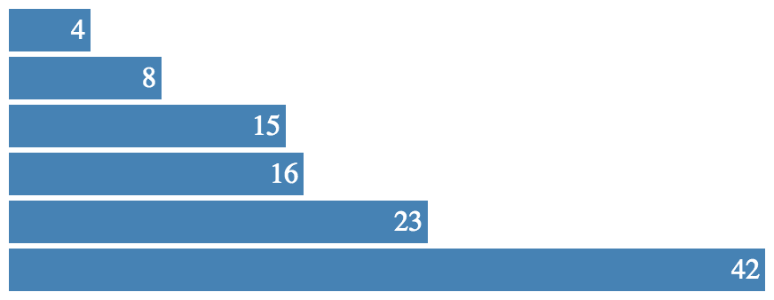

Test-drive D3 for much win! [](https://www.npmjs.com/package/testdrived3) [](https://travis-ci.org/thibaudcolas/testdrived3)
==========

__testdrived3__ is an intro to [D3](http://d3js.org/) via a set of self-guided workshops. It is based on the great [Let's Make a Bar Chart](http://bost.ocks.org/mike/bar/) tutorials from D3's creator, Mike Bostock.


1. Install [Node.js](http://nodejs.org/)
2. Run `npm install -g testdrived3`
3. Run `testdrived3`
4. **.. profit!**

## Content

This workshop guides you through the creation of a bar chart. You will learn D3's most important APIs:

- Manipulating HTML and SVG elements
- Data binding
- Scales and axes

We'll take you from:



To:

TODO


## Troubleshooting

This workshop relies on features only available in Node version 4 and above. To check your version, run `node --version` from the command line.

## Contributing

Install the project with:

```sh
git clone git@github.com:thibaudcolas/testdrived3.git
cd testdrived3
nvm install
npm install
npm install -g eslint babel-eslint eslint-config-airbnb
./.githooks/deploy
```

To run the workshopper locally:

```sh
node src/index.js
```

To release a new version:

```sh
npm version minor -m "Release %s"
git push origin master
git push --tags
npm publish
```

> Dependencies: [](https://david-dm.org/thibaudcolas/testdrived3) [](https://david-dm.org/thibaudcolas/testdrived3)
